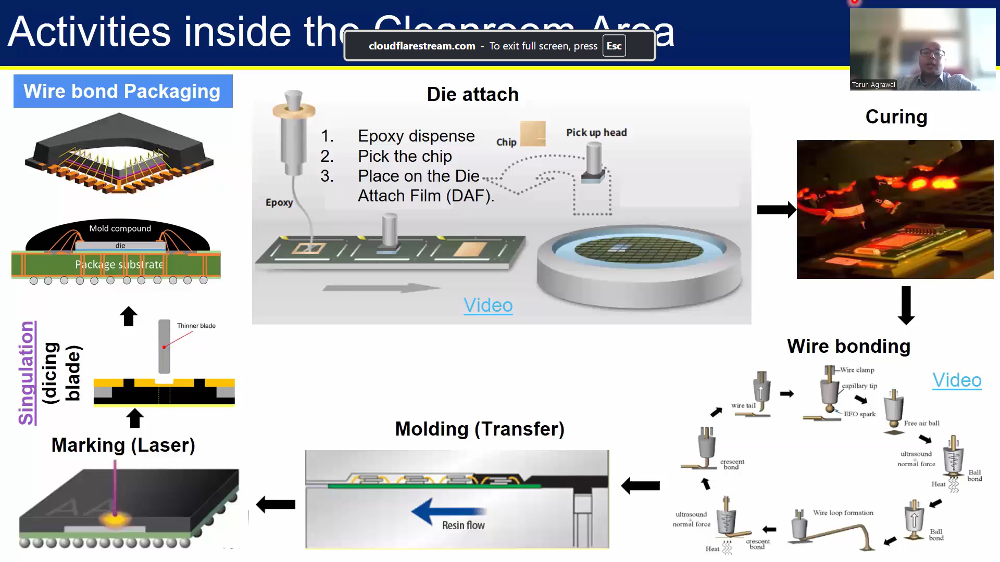

# Semiconductor Packaging workshop
Notes summarized for the Semiconductor workshop attended between 9th and 18th May 2025

## 1.	Packaging Evolution: From Basics to 3D Integration
        1. Introduction to Semiconductor Packaging and Industry Overview
        2. Understanding Package Requirements and Foundational Package Types
        3. Evolving Package Architectures from Single-chip to Multi-chip modules
        4. Interposers, Redistribution layer, and 3D Packaging Approaches
        5. Comparative Analysis and Selecting the Right Packaging Solution
## 2.	From Wafer to Package: Assembly and Manufacturing Essentials
    	1. Setting the Stage: Supply Chain and Facilities
    	2. Wafer pre-preparation: Grinding and Dicing
    	3. Wire Bond Packaging: Die attach to Molding
    	4. Flip Chip Assembly: Bump Formation and Underfill
    	5. Wafer Level Packaging And Conclusion
## 3.	Labs: Thermal Simulation of Semiconductor Packages with ANSYS
    	1. Introduction And Getting Started With ANSYS Electronics Desktop
    	2. Setting Up A Flip-Chip BGA Package
    	3. Material Definitions And Thermal Power Sources
    	4. Meshing And Running The Thermal Analysis
    	5. Summary
## 4.	Ensuring Package Reliability: Testing and Performance Validation
    	1. Introduction to Package Testing and Electrical Functionality Checks
    	2. Reliability and Performance Testing of Semiconductor Packages
## 5.	Package Design and Modeling: Building a Semiconductor Package from Scratch
    	1. Introduction to Package Cross-Section Modeling in ANSYS Electronics Desktop
    	2. Creating the Die and Substrate in AEDT
    	3. Adding Die Attach Material and Bond Pads
    	4. Wire Bond Creation and Material Assignment
    	5. Applying Mold Compound and Finalizing the Package Model
## 6.	Conclusion: Semiconductor Packaging

# 1. Packaging Evolution: From Basics to 3D Integration
## 1.1 Introduction to Semiconductor Packaging and Industry Overview
Semiconductor Packaging is needed to package the dies that come out of the wafer in a controlled environment of a clean room to be used in the real world.
Packaging is necessary to protect them from the environment and connect them to the real world.
Packaging helps in the following ways-
1. Protect the die from the environment and give it mechanical support (moisture, physical damage)
2. Electrical connections to the outer world.
3. Heat dissipation
           

### Package and Testing Industry
Companies are working in various sectors of the semiconductor industry.
1. **Fabless**: That only designs the chip.
2. **Foundry**: That takes the design and fabricates dies on the wafer, but does not design the chip
3. **IDM(Integrated Device Manufacturer)**: That does both designing and fabrication of the chip
4. **OSAT(Outsource Semiconductor Assembly and Test)**: That takes the dies from the wafer and packages them; they do not design or fabricate chips. 

## 1.2 Understanding Package Requirements and Foundational Package Types
### How to choose a package
Based on the listed requirements, packages are chosen for the packaging of the die.
 

### Typical Thermal Package Structure
This consists of die, mold compound, carrier, and System board(PCB).
Broadly speaking, there are two types of mounting technology on the System board
1. Through-hole mount technology: Pins are inserted in the system board.
2. Surface mount technology: Component leads are soldered to the surface-mounted pads instead of insertion.

## 1.3 Evolving Package Architectures from Single-chip to Multi-chip modules
## Anatomy of Package
### Lead Frame-based packages
A leadframe is a thin sheet of metal, typically copper or a copper alloy, that creates a die pad and leads for the outer world connection.
1. **Die Pad**: Area where the silicon die is mounted.
2. **Leads**: Serve as electrical connections between the die and the external PCB.
### Leadframe-type packages have
1. **Silicon die**
2. **Die attach** material that sticks the die onto the substrate.
3. **Wire bonds** that connect the die pads to leads for outerworld connection.
4. **Encapsulation** that surrounds all these components for safety, made using epoxy resin.
5. **Leads** the metal that extends out of this geometry.
### Common Lead-frame Package
1. **DIP (Dual In-line Package)** has pins that go into the PCB on both sides of its packaging, which is rectangular.
2. **QFP (Quad Flat Package)** Four-sided surface-mount package with fine-pitch leads on all sides.
3. **QFN (Quad Flat No-lead)** Exposed pad package without leads; pads are on the bottom for better thermal and electrical performance.
4. **DFN (Dual Flat No-lead)** Like QFN but with pads only on two sides. Very compact.

### Laminate-based Package
A laminate-based package has a multi-layer organic substrate rather than a metal leadframe.
### Common Laminate-Based Package Types
1. **Wire Bond PBGA (Plastic Ball Grid Array)** Die is connected via wirebonds to a laminated substrate with solder balls for board attachment.
2. **Flip Chip PBGA** Die is flipped and directly bonded to the substrate using solder bumps.
3. **LGA (Land Grid Array)** flat contacts for direct connection; no solder balls are used.

### Advanced package substrates
These packages are made for a larger number of dies on the same substrate, which gives high I/O pins and has lots of interconnection layers.
1. **2D**: Multiple dies placed side by side on a single substrate (FCBGA). Since there is no redistribution layer in this, the dies have a  longer path between them.
2. **2.1D**: Similar to 2D but includes RDL (Redistribution Layer) to improve routing and integration.
3. **2.3D**: Uses organic interposer to connect dies.
4. **2.5D**: Instead of Organic, a silicon interposer for high-speed interconnects between dies.

## 1.4 Interposers, Redistribution layer, and 3D Packaging Approaches
1. Redistribution Layers (RDL) is a metal layer added on top of a die or wafer to reroute the I/O pads to new locations. Connects different dies on the substrate, as without RDL, it takes longer for the dies to communicate with each other.
2. Interposer: Acts as an intermediate routing interface between the die and the substrate.
Silicon as an interposer reduces mechanical stress between the die and substrate as it has the same CTE as of die.

Nomenclature for the packages.
## 1.5 Comparative Analysis and Selecting the Right Packaging Solution
Different packages have different advantages and disadvantages, and uses, as can be seen from the image.

# 2 From Wafer to Package: Assembly and Manufacturing Essentials
## 2.1 Setting the Stage: Supply Chain and Facilities
The flowchart for a packaged chip coming to market goes like:

1. Design House: EDA tools are used to create a GDSII design. This design goes to the foundry.
2. Wafer Fabrication: The design wafer is fabricated. This fabricated wafer goes for packaging and testing.
3. Package Assembly and Test: The wafer is diced and packaged, and tested.
4. Board Assembly and Test: Different packages are assembled on the board and tested.
5. Product Assembly and Test: The Final product is created, packaged, and tested.
### Introduction of a Package Manufacturing Unit

Major difference between OSAT and ATMP is that OSAT does not produce wafers they take orders from different foundries and dice and package the chips.

## 2.2 Wafer pre-preparation: Grinding and Dicing
### Activities inside the Cleanroom
1. In a clean room facility of ISO Class 7, wafers are prepared.
2. These wafers are placed carefully in a carrier, which is then sent for inspection.
3. The top surface where the dies are is taped in a process called Wafer front tape lamination.
4. Since the wafers have dies on the front side only the backside is used just for support and it is hence grinded or cut off from the wafers.
5. After grinding, the backside of the wafer is taped and placed on the metal plate.
6. Wafer is diced accordingly, where the dies need to be cut.
7. Dies are ready to be packaged.

## 2.3 Wire Bond Packaging: Die attach to Molding
1. Die attach film is placed onto the substrate. This material is usually epoxy resin used as a glue to stick the die onto the substrate.
2. Then the die is placed onto the die attach film.
3. After placing it on the substrate, we cure it, meaning we heat it or use UV to set the material correctly onto the substrate and for the die to attach to it correctly.
4. **Wire bonds** are made using a gold ball, which is made using the Ultrasound or normal Force technique. After sticking the gold ball onto the die pad, it is stretched to the substrate pad to make a crescent bond.
5. For **Molding**, we flow the resin from right to left so it encapsulates the substrate along with wire bonds, die.
6. Packages are marked for tracability and then cut (**Singulation**).

## 2.4 Flip Chip Assembly: Bump Formation and Underfill
1. In flip bonding, we flip the chip, and a solder ball is made onto it.
2. This geometry ensures faster signal speed as the signal does not need to propagate for long interconnects.
3. Flux is added onto this geometry and heated for the solder to get attached correctly.
4. Excess flux is cleaned off.
5. Underfill Dispensing is done to keep everything in place, and then Curing is done(Heating).
6. After all this process molding is done for encapsulation of the whole geometry.
7. Marking is done for traceability.
8. Ball mounting is done on the Substrate.
9. After ball mounting and reflow, we get a Flip chip bonded Package.

## 2.5 Wafer Level Packaging And Conclusion
Wafer-Level Packaging is a technique where the whole packaging process is done at the wafer level.
This helps in reducing the size of the package, faster speed, and reducing Form Factor.
Good dies are picked from the wafer and placed for the reconstitution process, molded to get a reconstituted wafer after carrier release.
### Types of Wafer-Level Packaging
Fan-In WLP – Interconnects remain within the die footprint
Fan-Out WLP (FOWLP) – Interconnects extend beyond the dies for more I/Os.
### RDL Preparation
1. RDL is combination of dielectric and metal which is patterned again and again for getting the desired number of layers for interconnections.

# 3 Labs: Thermal Simulation of Semiconductor Packages with ANSYS

## 3.1 Introduction And Getting Started With ANSYS Electronics Desktop
In this, we will be using the  Icepack of the Ansys Electronics Desktop Software to generate the temperature graph for the Flip chip BGA package.
 1. Insert the Icepack Design after Launching the Ansys Software.
## 3.2 Setting Up A Flip-Chip BGA Package
 2. Go to: Icepak > Toolkit > Geometry > Packages > Flipchip_BGA to get the Flip-chip BGA package.
 3. Set parameters:
          
         `xLength:` 15 mm  
         `yLength:` 15 mm  
         `Package Thickness:` 3 mm. As we will be working on this size
## 3.3 Material Definitions And Thermal Power Sources
 4. Navigate to: `Project Manager > Thermal` and Set Power to `1W` and apply
 5. Select `Flipchip-BGA1_substrate` from Solids and Right-click: Assign Thermal > Source to assign it. Set the condition to Ambient Temperature.
## 3.4 Meshing And Running The Thermal Analysis
 6. Assign temperature monitor points to: Substrate, Die, and Underfill, as these three will generate the temperature gradient for the package.
 7. Go to: Mesh > Generate Mesh
 8. Click Validate from the toolbar
 9. Click Analyze All
 Go to: Plot Field > Temperature and Configure plot settings: 
`Enable: Specify Name, Folder, Plot Surface Only` 
`Enable: Gaussian Surface Smoothing`
## 3.5 Viewing Results and Exploring Other Package Types.

